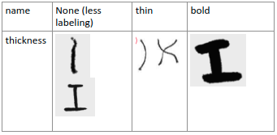
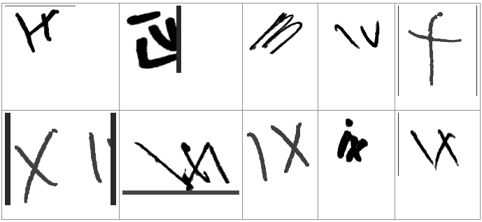
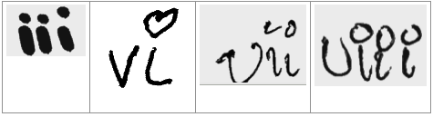

# Labeling Guide

I used [SuperAnnotate](https://superannotate.com/download/) to label the data because I found this software to be the most flexible in allowing attribute labeling and it is free.

Draw bounding box as close to the symbol as possible.

## Symbol

The classes are roman numerals and perfect examples of them can be found in [data/raw/label_book](data/raw/label_book).

However, life isn't as easy as the examples given. For ones that doesn't align with `label_book` please refer to this special mapping. The main purpose is to be consistent.

## Thickness

How thick the lines are.

## Confusing

Were you confused with this symbol. This is for labeler to measure their confidence.

* on-fence : means that you are on the fence between two symbols
* no-clue : you have no confidence in what symbol this is

## Suggestion

This is more for the data scientist to judge; however, labeler can be trained to determine if these example should be removed. The objective is to give the data scientist to select during their training whether to keep or remove examples that are deem as too noisy and will degrade the model.

* none : you can leave this empty
* remove : you believe that removing this during training is better

# Other

Not yet implement attributes, but could be useful in the future.

## Noise

## Angle

## Uniqueness

## Curviness

## Dot Format

## Disjoined

## Incompleteness

